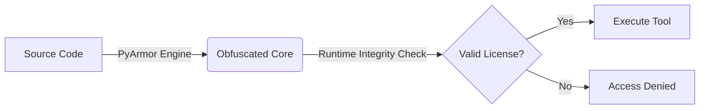

<div align="center">

  

  # 🛡️ IG-Reporter Pro
  **Automated Instagram Reporting & Flagging Tool**

  <p>
    <a href="#">
      
    </a>
    <a href="#">
      
    </a>
    <a href="#">
      
    </a>
  </p>

  <p>
    <i>A powerful CLI tool designed to automate mass reporting and flagging on Instagram.<br>
    Built for speed, efficiency, and account removal testing.</i>
  </p>
  <br>
</div>

<details>
  <summary><b>📚 Table of Contents</b> (Click to Expand)</summary>
  <br>
  
  - [Overview](#-overview)
  - [Key Features](#-key-features)
  - [Security Architecture](#-security-architecture)
  - [Installation Guide](#-installation-guide)
  - [Usage Instructions](#-usage-instructions)
  - [Disclaimer](#-disclaimer)
  
</details>
---

## 📌 Overview

**IG-Reporter** is a specialized automation script designed to streamline the reporting process on Instagram. Unlike basic scripts, this tool is built with a focus on **User Experience (UX)** and **Security**.

It utilizes the `Rich` library to provide a real-time, responsive Command Line Interface (CLI) that displays statistics, logs, and target information in a visually organized manner.

> **Note:** This software is distributed as a **Protected Build**. The source code is obfuscated using **PyArmor** to prevent reverse engineering while ensuring full functionality on your machine.

---

## 🚀 Key Features

| Feature | Description |
| :--- | :--- |
| **🎨 Modern UI** | A sleek, table-based dashboard powered by the `Rich` library. |
| **⚡ Smart Automation** | Automated sleep timers and request randomization to avoid rate limits. |
| **🔍 Auto-Resolver** | Automatically fetches `UserID` from any given `Username`. |
| **🛡️ Ban Protection** | Built-in detection for HTTP 429 (Too Many Requests) & 500 status codes. |
| **📝 Live Logging** | Detailed success/fail logs with color-coded status indicators. |
| **🔐 Secure Login** | Uses `SessionID` & `CSRFToken` for authentication (No password storage). |

---

---

## 🔒 Security Architecture

This tool is secured using industry-standard obfuscation techniques to ensure integrity and preventing reverse engineering.


## 📥 Installation Guide

Follow these steps to set up the environment correctly.

### 1. Prerequisites

* Ensure you have **Python 3.10+** installed.
* [Download Python Here](https://www.python.org/downloads/)

### 2. Install Dependencies

Open your terminal in the project directory and run:

```bash
pip install requests rich

```

### 3. Verify File Structure

Ensure your directory looks exactly like this to avoid `Runtime Errors`:

```text
IG-Reporter/
├── pytransform/          <-- Critical Security Folder (Do Not Delete)
├── main.py               <-- The Application Executable
├── requirements.txt      <-- Dependencies List
└── README.md             <-- Documentation

```
```markdown

## ⚙️ Usage Instructions

### 1. Launch the Tool
Run the script using the Python interpreter:
```bash
python main.py

```

### 2. Authenticate Session

The tool requires a valid session to interact with Instagram's API.

> [!TIP]
> **How to get your SessionID & CSRFToken:**
> 1. Open your browser and log in to Instagram.
> 2. Press **F12** to open Developer Tools.
> 3. Go to the **Application** tab > **Cookies** > `https://www.instagram.com`.
> 4. Copy the values for `sessionid` and `csrftoken`.


```markdown
### 3. Select Target
* Enter the **Username** of the account you wish to test.
* The tool will automatically resolve the username to a numeric `UserID`.

### 4. Monitor Process
* Watch the CLI dashboard for real-time progress, status codes, and success rates.
```
## ⚠️ Disclaimer

<div align="center">
  <br>
  
  
  <br><br>

  <p>
    <b>🛑 This tool is developed strictly for security research and educational purposes.</b>
  </p>
</div>

---

> [!CAUTION]
> **The developer is not responsible for any misuse of this software.**

* 🚫 **Terms of Service:** Using this tool to harass users or spam Instagram's servers is a strict violation of their Terms of Service.
* ✅ **Ethical Use:** Use responsibly and **only on accounts you own** or have explicit permission to test.
